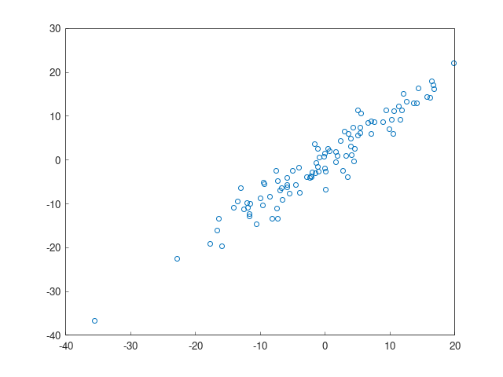
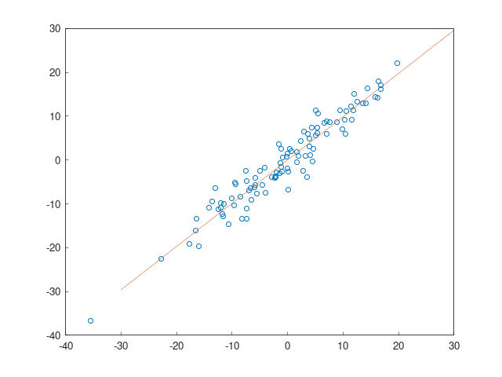

Linear Regression
------------

Linear regression is a way to find the linear relationship between the dependent and independent variable by minimizing the distance.

Linear regression is a supervised machine learning approach. This approach is used for classification of order discrete category. 
In this section, we will understand how to build a model by which a user can predict the relationship between the dependent and independent variable.

In simple terms, we can say the relationship between both the variable, i.e., independent or dependent, is known as linear. 
Suppose **Y** is the dependent and **X** is an independent variable, then the linear regression relationship of these two variables is **Y=AX+b**

**Steps to follow**
1. Datasets ==> x_data, y_data
2. Linear regression model ==> model with 1 input and 1 output
3. Define the optimizer 
4. Train the model through 1000 iterations
5. Plot the results

**These are what I got**

